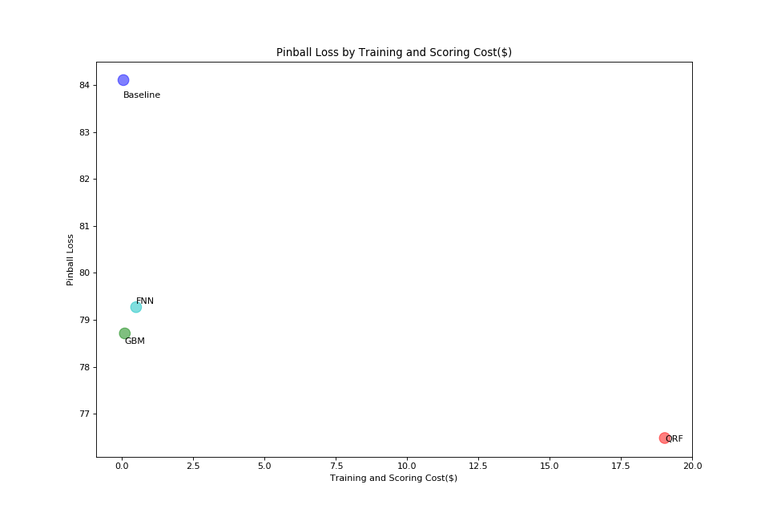
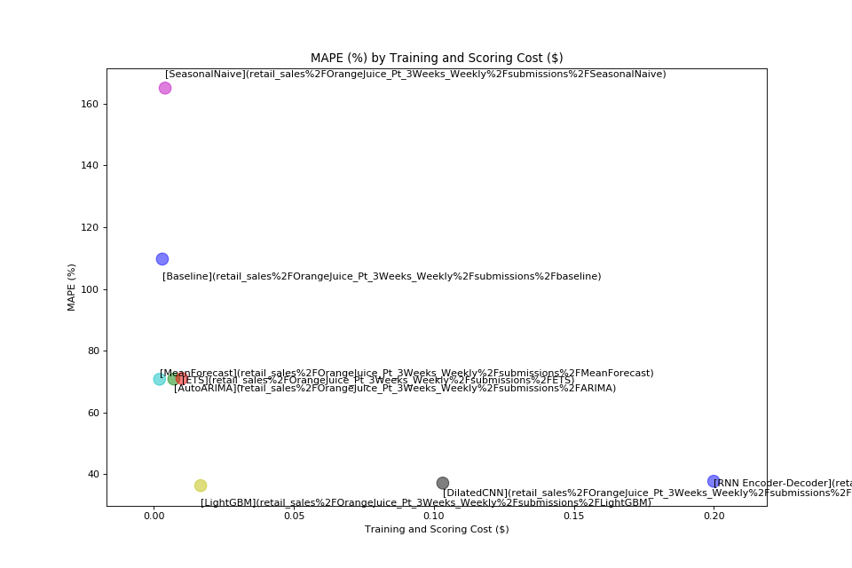

# TSPerf

TSPerf is a framework that allows discovery and comparison of various time-series forecasting algorithms and architectures on a cloud-based environment. This framework allows data scientists to discover the best approach that fits their use case from cost, time and quality perspective.
 TSPerf framework is designed to facilitate data science community participation and contribution through the development of benchmark implementations against a given set of forecasting problems and datasets. Benchmark implementations are measured in terms of standard metrics of model accuracy, training cost and model training time. Each implementation includes all the necessary instructions and tools that ensure its reproducibility on Azure customer's subscription. We plan to leverage TSPerf to propose a new time-series forecasting track in [MLPerf](https://mlperf.org/).
The following table summarizes benchmarks that are currently included in TSPerf.

Benchmark                                   |  Dataset               |  Benchmark directory
--------------------------------------------|------------------------|---------------------------------------------
Probabilistic electricity load forecasting  |  GEFCom2017            |  `energy_load/GEFCom2017-D_Prob_MT_Hourly`
Retail sales forecasting                    |  Orange Juice dataset  |  `retail_sales/OrangeJuice_Pt_3Weeks_Weekly`

A complete documentation of TSPerf, along with the instructions for submitting and reviewing benchmark implementations, can be found [here](./docs/tsperf_rules.md). The tables below show performance of benchmark implementations that are developed so far. These tables are referred to as *performance boards*. Source code of benchmark implementations and instructions for reproducing their performance can be found in submission folders, which are linked in the last column of performance boards.

## Probabilistic energy forecasting performance board

The following table lists the current submision for the energy foercasting and their respective performances.

Submission Name  |  Pinball Loss  |  Training and Scoring Time (Sec)  |  Training and Scoring Cost($)  |  Architecture                                 |  Framework                         |  Algorithm                            |  Uni/Multivariate  |  Exteranl Feature Support  |  Submission Folder URL
-----------------|----------------|-----------------------------------|--------------------------------|-----------------------------------------------|------------------------------------|---------------------------------------|--------------------|----------------------------|-----------------------------------------------------------------------------------------------------------------------------------------------------------------------------------------
Baseline         |  84.66         |  446                              |  0.05                          |  Linux DSVM (Standard D8s v3 - Premium SSD)   |  quantreg package of R             |  Linear Quantile Regression           |  Multivariate      |  Yes                       |  [link](https://msdata.visualstudio.com/AlgorithmsAndDataScience/_git/TSPerf?path=%2Fenergy_load%2FGEFCom2017_D_Prob_MT_hourly%2Fsubmissions%2Fbaseline&version=GBmaster)
GBM              |  78.73         |  1055                             |  0.11                          |  Linux DSVM (Standard D8s v3 - Premium SSD)   |  gbm package of R                  |  Gradient Boosting Decision Tree      |  Multivariate      |  Yes                       |  [link](https://msdata.visualstudio.com/AlgorithmsAndDataScience/_git/TSPerf?path=%2Fenergy_load%2FGEFCom2017_D_Prob_MT_hourly%2Fsubmissions%2FGBM%2FREADME.md&version=GBvapaunic%2Fgbm)
QRF              |   76.48        |   22709                           |   19.03                        |   Linux DSVM (F72s v2 - Premium SSD)          |   scikit-garden package of Python  |   Quantile Regression Forest          |   Multivariate     |   Yes                      |   [link](https://msdata.visualstudio.com/AlgorithmsAndDataScience/_git/TSPerf?path=%2Fenergy_load%2FGEFCom2017_D_Prob_MT_hourly%2Fsubmissions%2Fqrf&version=GBmaster)
FNN              |   80.24        |   5095                            |   0.5435                       |   Linux DSVM (Standard D8s v3 - Premium SSD)  |   qrnn package of R                |   Quantile Regression Neural Network  |   Multivariate     |   Yes                      |   [link](https://msdata.visualstudio.com/AlgorithmsAndDataScience/_git/TSPerf?path=%2Fenergy_load%2FGEFCom2017_D_Prob_MT_hourly%2Fsubmissions%2Ffnn&version=GBmaster)

The following chart compares the submissions performance on accuracy in Pinball Loss vs. Training and Scoring cost in $:

 

## Retail sales forecasting performance board

The following table lists the current submision for the retail foercasting and their respective performances.

Submission Name      |  MAPE (%)  |  Training and Scoring Time (sec)  |  Training and Scoring Cost ($)  |  Architecture                                |  Framework                   |  Algorithm                                                          |  Uni/Multivariate  |  Exteranl Feature Support  |  Submission Folder URL
---------------------|------------|-----------------------------------|---------------------------------|----------------------------------------------|------------------------------|---------------------------------------------------------------------|--------------------|----------------------------|------------------------------------------------------------------------------------------------------------------------------------------------------------------------------------------------
Baseline             |  109.67    |  114.06                           |  0.003                          |  Linux DSVM(Standard D2s v3 - Premium SSD)   |  forecast package of R       |  Naive Forecast                                                     |  Univariate        |  No                        |  [link](https://msdata.visualstudio.com/AlgorithmsAndDataScience/_git/TSPerf?path=%2Fretail_sales%2FOrangeJuice_Pt_3Weeks_Weekly%2Fbaseline%2FNaive&version=GBmaster)
AutoARIMA            |  70.80     |  265.94                           |  0.0071                         |  Linux DSVM(Standard D2s v3 - Premium SSD)   |  forecast package of R       |  Auto ARIMA                                                         |  Multivariate      |  Yes                       |  [link](https://msdata.visualstudio.com/AlgorithmsAndDataScience/_git/TSPerf?path=%2Fretail_sales%2FOrangeJuice_Pt_3Weeks_Weekly%2Fsubmissions%2FAutoARIMA&version=GBmaster)
ETS                  |  70.99     |  277                              |  0.01                           |  Linux DSVM(Standard D2s v3 - Premium SSD)   |  forecast package of R       |  ETS                                                                |  Multivariate      |  No                        |  [link](https://msdata.visualstudio.com/AlgorithmsAndDataScience/_git/TSPerf?path=%2Fretail_sales%2FOrangeJuice_Pt_3Weeks_Weekly%2Fsubmissions%2FETS&version=GBmaster)
MeanForecast         |  70.74     |  69.88                            |  0.002                          |  Linux DSVM(Standard D2s v3 - Premium SSD)   |  forecast package of R       |  Mean forecast                                                      |   Univariate       |  No                        |  [link](https://msdata.visualstudio.com/AlgorithmsAndDataScience/_git/TSPerf?path=%2Fretail_sales%2FOrangeJuice_Pt_3Weeks_Weekly%2Fsubmissions%2FMeanForecast&version=GBmaster)
SeasonalNaive        |  165.06    |  160.45                           |  0.004                          |  Linux DSVM(Standard D2s v3 - Premium SSD)   |  forecast package of R       |  Seasonal Naive                                                     |  Univariate        |  No                        |  [link](https://msdata.visualstudio.com/AlgorithmsAndDataScience/_git/TSPerf?path=%2Fretail_sales%2FOrangeJuice_Pt_3Weeks_Weekly%2Fsubmissions%2FSeasonalNaive&version=GBmaster)
LightGBM             |  36.28     |  625.10                           |  0.0167                         |  Linux DSVM (Standard D2s v3 - Premium SSD)  |  lightGBM package of Python  |  Gradient Boosting Decision Tree                                    |  Multivariate      |  Yes                       |   [link](https://msdata.visualstudio.com/AlgorithmsAndDataScience/_git/TSPerf?path=%2Fretail_sales%2FOrangeJuice_Pt_3Weeks_Weekly%2Fsubmissions%2FLightGBM&version=GBmaster)
DilatedCNN           |  37.09     |  413                              |  0.1032                         |  Ubuntu VM(NC6 - Standard HDD)               |  Keras and Tensorflow        |  Python + Dilated convolutional neural network                      |   Multivariate     |  Yes                       |  [link](https://msdata.visualstudio.com/AlgorithmsAndDataScience/_git/TSPerf?path=%2Fretail_sales%2FOrangeJuice_Pt_3Weeks_Weekly%2Fsubmissions%2FDilatedCNN&version=GBchenhui%2Fwavenet)
RNN Encoder-Decoder  |  37.68     |  669                              |  0.2                            |  Ubuntu VM(NC6 - Standard HDD)               |  Tensorflow                  |  Python + Encoder-decoder architecture of recurrent neural network  |   Multivariate     |  Yes                       |  [link](https://msdata.visualstudio.com/AlgorithmsAndDataScience/_git/TSPerf?path=%2Fretail_sales%2FOrangeJuice_Pt_3Weeks_Weekly%2Fsubmissions%2FRNN&version=GByiychen%2Fretail_rnn_submission)

The following chart compares the submissions performance on accuracy in %MAPE vs. Training and Scoring cost in $:

 

