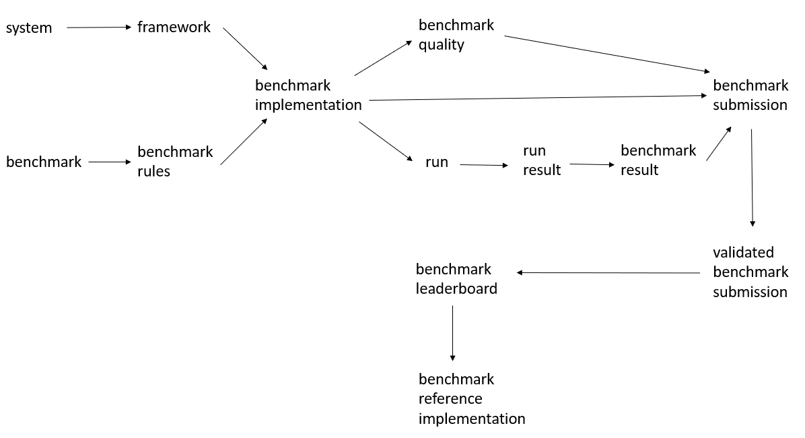

# TSPerf Rules

## Introduction

Vision, goals (Ilan - 3)

## Framework

Framework goals

### Definitions 
We adopt several definitions from [MLPerf](https://github.com/mlperf/policies/blob/master/rules.adoc) 
and also add a number of new ones:

A *benchmark* is an abstract problem that can be solved using ML by training a model based on a 
specific dataset.

*Benchmark rules* is a set of rules for implementing a benchmark to produce a class of comparable 
results, such as training and test set partition, performance evaluation metric and process.

A *system* consists of a defined set of cloud hardware resources and services such as processors, 
memories, disks, clusters and interconnect. It also includes specific versions of all software such as 
operating system, compilers, libraries, and drivers that significantly influences the running time, 
excluding the ML framework.

A *framework* is a specific version of a software library or set of related libraries, possibly with 
associated offline compiler, for training ML models using a system. Examples include specific versions 
of Caffe2, MXNet, PaddlePaddle, pyTorch, or TensorFlow.

A *benchmark implementation* is an implementation of a benchmark in a particular framework by a user 
under the benchmark rules.

*Benchmark quality* is performance metric value of a benchmark implementation, measured according to 
benchmark rules.

A *run* is a complete execution of a benchmark implementation on a system, training a model from 
initialization to the specified  quality target.

A *run result* is the wallclock time and cost required for a run.

A *benchmark result*  is the median of five run results.

A *benchmark submission* is a source code of benchmark implementation, along with declared benchmark 
quality and  benchmark result.

A *validated benchmark submission* is a benchmark submission that passed review process.

A *benchmark leaderboard* is a table of validated benchmark submissions.

A *benchmark reference implementation* is a specific validated benchmark submission chosen from the 
leaderboard. 

The following diagram summarizes the relations betwwen different terms: 

### Structure and hierarchy of documents 
Ilan

### Structure of repository 
Chenhui

## Benchmarks
training, test sets, what should be predicted, metrics

### Energy consumption forecasting  
Hong

### Retail sales forecasting 
Chenhui

## Development of benchmark implementation

### Availables Docker images
Description of the available Docker images  
Chenhui

### Guideline for measuring performance
Guideline for measuring performance  
Chenhui 

## Submission

### Guideline for submitting reproduction instructions
Guidance for submitting reproduction instructions  
Hong, Ilan  

### Guideline for submitting the code
Guidance for submitting the code  
Chenhui, Ilan 

## Review of submissions
The goal of the review is to validate the declared

* quality of the model 
* running time
* cloud cost  

We will explain below how to validate these quantities. Additionally the reviewer should check that the 
evaluation of the quality of the model is done using a standard `evaluate.py` script and that the code

* does not use test data for training
* has a good quality 
* is well documented

We do not have specific guidelines for checking these items. Reviewer should use his/her own judgement 
to decide if there is no test data leakage and if the code or documentation need improvement.

Reviewer should set up execution environment before running benchmark implementation. Initially the 
reviewer needs to complete the following three steps:

0. Verify that the submission has README.md file with  
    * name of the branch with submission code
    * benchmark path, for example /TSPerf/energy_load/problem1
    * path to submission directory, for example  /TSPerf/energy_load/problem1/benchmarks/submission1
    * instructions for provisioning the system (e.g. DSVM, Batch AI)
    * name of Docker image stored in tsperf registry, for example 
    tsperf.azurecr.io/energy_load/problem1/submission1/submission1_image:v1

In the following sections all occurences of "README file" refer to README file in the submission, unless 
specified otherwise.

The next steps depend on the system and are described in the following two subsections.

### Standalone VM

1. Follow the instructions in the README file and provision the virtual machine that was used to generate 
benchmark results. Then log into the provisioned VM.

2. Choose submission branch and clone the Github repo to your machine:

        git clone https://msdata.visualstudio.com/DefaultCollection/AlgorithmsAndDataScience/_git/TSPerf
        git checkout <branch name>

3. Download the data using the following commands

        python <benchmark path>/common/get_data.py

    where \<benchmark path\> is a root benchmark directory, for example energy_load/problem1

4. Log into Azure Container Registry:
   
       docker login --username tsperf --password <ACR Access Key> tsperf.azurecr.io
   
   If want to execute docker commands without sudo as a non-root user, you need to create a Unix group and 
   add users to it by following the instructions 
   [here](https://docs.docker.com/install/linux/linux-postinstall/#manage-docker-as-a-non-root-user).

5. Pull a Docker image from ACR, using image name that is specified in README file:   
      
       docker pull <image name>

6. Choose a name for a new Docker container and create it using command:   
   
       docker run -it -v ~/TSPerf:/TSPerf --name <container name> <image name>
   
   Note that you need to mount `/TSPerf` folder (the one you cloned) to the container so that you will 
   have access to the source code in the container. 

7. Inside Docker container, run the following command:  

       source <benchmark directory>/common/train_score_vm <submission directory> 

   This will generate 5 `submission_<seed number>.csv` files in the submission directory, where \<seed number\> 
   is between 1 and 5. This command will also output 5 running times of train_score.py. The median of the times 
   reported in rows starting with 'real' should be compared against the wallclock time declared in benchmark 
   submission.
   
8. Evaluate the benchmark quality by running

       source <benchmark directory>/common/evaluate <submission directory> <benchmark directory>

    This command will output 5 benchmark quality values (e.g. MAPEs). Their median should be compared against the 
    benchmark quality declared in benchmark submission.

### Batch AI

1. Provision Linux Data Science VM with DS4v2 configuration. 

2. Choose submission branch and clone the Github repo to your machine:

        git clone https://msdata.visualstudio.com/DefaultCollection/AlgorithmsAndDataScience/_git/TSPerf
        git checkout <branch name>

3. Download the data using the following commands

        python <benchmark path>/common/get_data.py

    where \<benchmark path\> is a root benchmark directory, for example energy_load/problem1

4. Follow the instructions in the README file and provision the resource group, Batch AI workspace, Batch AI cluster 
and storage account with file share and blob storage. When creating resources, please record *resource group name*, 
*storage account name*, *storage account key* and *file share name*. You will need to provide these parameters in the 
later steps.

5. Upload <submission directory>/train_score.py script to file share account by following the instructions in README 
file.

6. Upload the dataset to blob storage by following the instructions in README file.

7. Create Batch AI experiment:

       az batchai experiment create -g <resource group name> -w <workspace name > -n <submission name>

   where resource group name and workspace name are the ones used in step 4. Submission name is rightmost directory in 
   submission path. 

8. Run 5 Batch AI jobs

        source  train_score_batchai <resource group name> <workspace name> <cluster name> <submission directory> 
        <storage account name>

    This command will generate 5 `submission_<seed number>.csv` files, where \<seed number\> is between 1 and 5. The 
    location of these files in file share storage will be printed out. This command will also output 5 running times of 
    Batch AI jobs. The median of these times should be compared against the wallclock time declared in benchmark 
    submission. 

9.  Run the following command to download the first submission file:

        az storage file download --account-name <storage account name> --account-key <storage account key> --share-name 
        <file share name> --path <file share path to submission file of the first run> --dest 
        <submission directory>/submission_1.csv

    Repeat this command for other 4 submission files, by replacing pathes in `--path` and `--dest` parameters. 

10. Evaluate the benchmark quality by running

       source <benchmark directory>/common/evaluate <submission directory> <benchmark directory>

    This command will output 5 benchmark quality values (e.g. MAPEs). Their median should be compared against the 
    benchmark quality declared in the benchmark submission.

## Leaderboard
Each benchmark will have a separate leaderboards. All leaderboards will have the following columns:
* submission name
* URL of submission folder in VSTS
* benchmark quality (e.g. MAPE)
* running time
* cost
* system (e.g. DSVM)
* framework (e.g. Tensorflow)
* algorithm (e.g. LSTM)  

Each row will be a validated benchmark submission. Leaderboard will be updated by reviewer, after validating a benchmark 
submission. Every validated benchmark submission will be shown in the leaderboard. Since benchmark submission are measured 
by three parameters (quality, running time and cost), there will be no ranking between leaderboard entries.

## Selection of reference implementation

How reference implementation will be selected   
Dmitry